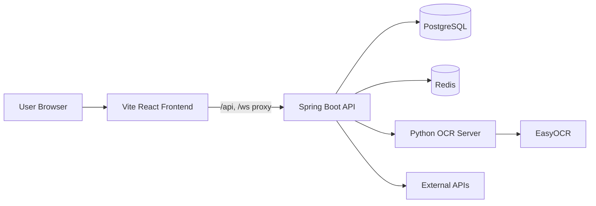

<div align="center">
  

  <h1>DevPath</h1>
  <p><strong>개발자의 학습, 프로젝트, 커리어 성장을 하나로 잇는 성장 플랫폼</strong></p>

  <p>
    <a href="https://devpath.kr"><strong>서비스 바로가기</strong></a>
    ·
    <a href="#서비스-한눈에-보기">서비스 소개</a>
    ·
    <a href="#자세히-보기">자세히 보기</a>
    ·
    <a href="#팀원">팀원</a>
  </p>

  <p>
    
    
    
    
    
    
    
  </p>
</div>

---

## 서비스 한눈에 보기

DevPath는 개발자의 성장 과정을 학습, 실습, 협업, 커리어까지 연결하는 웹 플랫폼입니다.
학습자는 맞춤 로드맵과 강의로 방향을 잡고, 팀 워크스페이스와 멘토링으로 프로젝트 경험을 쌓으며, 커리어 기능으로 결과물을 정리할 수 있습니다.

| 구분 | 내용 |
| --- | --- |
| 서비스 URL | [https://devpath.kr](https://devpath.kr) |
| 주요 사용자 | 학습자, 강사, 관리자 |
| 핵심 흐름 | 로드맵 추천 → 강의 학습 → 프로젝트 협업 → 포트폴리오와 채용 분석 |
| 레포 구성 | Spring Boot 백엔드, Vite React 프론트엔드, Python OCR 서버, Docker Compose 인프라 |

## 주요 카테고리

| 아이콘 | 카테고리 | 핵심 기능 |
| --- | --- | --- |
| 🧭 | 학습 로드맵 | 맞춤 로드맵, 강의 탐색, 학습 플레이어, 퀴즈와 과제 |
| 🧑‍🏫 | 강사 운영 | 강의 관리, 콘텐츠 편집, 수강생 분석, Q&A, 수익 관리 |
| 🧩 | 팀 프로젝트 | 워크스페이스, 칸반, 일정, 파일, 회의, ERD, 코드 리뷰 |
| 💼 | 커리어 | 채용 분석, 이력서, 포트폴리오, Proof Card, 쇼케이스 |
| 💬 | 커뮤니티 | 라운지, 게시글, 댓글, 좋아요, 멘토링 허브 |
| 🛡️ | 관리자 | 계정 관리, 로드맵 거버넌스, 신고 처리, 공지, 정산 |
| 🤖 | AI/OCR | AI 코드 리뷰, AI 디자인 리뷰, 영상 학습 OCR, EasyOCR 연동 |

## 자세히 보기

<details>
<summary><strong>🧭 서비스 핵심 기능 자세히 보기</strong></summary>

### 학습자

- 맞춤 로드맵과 로드맵 허브를 통해 학습 방향을 탐색합니다.
- 강의 목록과 학습 플레이어로 콘텐츠를 수강합니다.
- 퀴즈, 과제, 학습 로그를 통해 학습 결과를 관리합니다.

### 강사

- 강의와 콘텐츠를 등록하고 관리합니다.
- 과제와 퀴즈를 편집하고 수강생 학습 데이터를 확인합니다.
- 멘토링, Q&A, 리뷰, 수익 관리 화면을 제공합니다.

### 프로젝트와 협업

- 팀 워크스페이스에서 칸반, 일정, 파일, 회의, ERD를 관리합니다.
- 스쿼드 워크스페이스와 멘토링 워크스페이스를 제공합니다.
- 코드 리뷰와 실시간 협업 흐름을 지원합니다.

### 커리어와 커뮤니티

- 채용 분석, 이력서, 포트폴리오, Proof Card 기능을 제공합니다.
- 커뮤니티 라운지, 게시글, 댓글, 좋아요, 쇼케이스를 제공합니다.

### 관리자

- 관리자 대시보드에서 계정, 콘텐츠, 강의, 로드맵, 신고, 공지, 정산을 운영합니다.
- 로드맵 노드, 태그, 정책, 강의 매핑을 관리합니다.

</details>

<details>
<summary><strong>🏗️ 아키텍처 자세히 보기</strong></summary>



| 구성 | 역할 |
| --- | --- |
| Vite React Frontend | 사용자 화면, 라우팅, API 프록시 |
| Spring Boot API | 인증, 도메인 API, 관리자 기능, 실시간 기능 |
| PostgreSQL | 핵심 서비스 데이터 저장 |
| Redis | 캐시와 세션성 데이터 처리 |
| Python OCR Server | 학습 영상과 이미지 기반 OCR 처리 |
| External APIs | OAuth, AI, 채용 정보 등 외부 연동 |

</details>

<details>
<summary><strong>🛠️ 기술 스택 자세히 보기</strong></summary>

| 구분 | 기술 |
| --- | --- |
| Backend | Java 21, Spring Boot 4, Spring Web MVC, Spring Security, OAuth2 Client, JWT, JPA |
| Frontend | React 19, TypeScript 5.9, Vite 8, Tailwind CSS 4, Axios, Chart.js |
| Database | PostgreSQL 15, Redis 7 |
| AI/OCR | Gemini API 연동, Flask, EasyOCR, OpenCV, Tesseract.js |
| Docs | Springdoc OpenAPI, Swagger UI |
| Infra | Docker, Docker Compose, Nginx |
| Quality | JUnit Platform, H2 테스트 런타임, Spotless, ESLint |

</details>

<details>
<summary><strong>🚀 로컬 실행 자세히 보기</strong></summary>

### 사전 준비

- JDK 21
- Node.js 20 이상
- Docker Desktop 또는 Docker Compose
- PostgreSQL과 Redis를 직접 띄우거나 Docker Compose 사용

### 환경 변수

실제 `.env` 값은 공개 저장소에 올리면 안 됩니다.
README에는 필요한 키를 알려주는 예시만 둡니다.
팀에서 공유하는 실제 값은 비공개 채널, 시크릿 관리 도구, 배포 환경 변수로 관리합니다.

```properties
SERVER_PORT=8083

DB_HOST=localhost
DB_PORT=5432
DB_NAME=<database-name>
DB_USER=<database-user>
DB_PASSWORD=<database-password>

REDIS_HOST=localhost
REDIS_PORT=6379
REDIS_PASSWORD=<redis-password>

JWT_SECRET=<base64-hmac-secret>

GITHUB_CLIENT_ID=<github-oauth-client-id>
GITHUB_CLIENT_SECRET=<github-oauth-client-secret>
GOOGLE_CLIENT_ID=<google-oauth-client-id>
GOOGLE_CLIENT_SECRET=<google-oauth-client-secret>

DEVPATH_OAUTH2_REDIRECT_URL=http://localhost:8084/oauth2/redirect
DEVPATH_OAUTH2_ALLOWED_ORIGINS=http://localhost:8084
DEVPATH_CORS_ALLOWED_ORIGINS=http://localhost:8084
DEVPATH_REQUIRE_HTTPS=false

OCR_SERVER_URL=http://localhost:5000
GEMINI_API_KEY=<gemini-api-key>
```

### 인프라 실행

```bash
docker compose up -d postgres redis ocr-server
```

### 백엔드 실행

```bash
./gradlew bootRun
```

Windows PowerShell에서는 아래 명령을 사용할 수 있습니다.

```powershell
.\gradlew.bat bootRun
```

### 프론트엔드 실행

```bash
cd frontend
npm install
npm run dev
```

### Docker Compose 전체 실행

```bash
docker compose up -d --build
```

정적 Nginx 프론트엔드 이미지를 확인하려면 `frontend-static` 프로필을 사용합니다.

```bash
docker compose --profile frontend-static up -d --build frontend
```

</details>

<details>
<summary><strong>🔗 로컬 URL과 주요 화면 자세히 보기</strong></summary>

### Local URLs

| 서비스 | 주소 |
| --- | --- |
| Frontend | http://localhost:8084 |
| Backend API | http://localhost:8083 |
| Swagger UI | http://localhost:8083/swagger-ui/index.html |
| OCR Server | http://localhost:5000/health |

### Main Pages

| 경로 | 화면 |
| --- | --- |
| `/` 또는 `/home` | 서비스 홈 |
| `/roadmap-hub` | 로드맵 허브 |
| `/lecture-list` | 강의 목록 |
| `/learning` | 학습 플레이어 |
| `/workspace-hub` | 워크스페이스 허브 |
| `/team-ws-dashboard` | 팀 워크스페이스 |
| `/mentoring-hub` | 멘토링 허브 |
| `/job-matching` | 채용 분석 |
| `/community-list` | 커뮤니티 |
| `/admin-dashboard` | 관리자 대시보드 |

### API Docs

백엔드 실행 후 Swagger UI에서 API를 확인할 수 있습니다.

```text
http://localhost:8083/swagger-ui/index.html
```

Vite 개발 서버에서는 프록시가 설정되어 있어 `/api`, `/ws`, `/swagger-ui`, `/v3/api-docs`, `/uploads` 요청이 백엔드로 전달됩니다.

</details>

<details>
<summary><strong>📁 프로젝트 구조 자세히 보기</strong></summary>

```text
DevPath
├─ src/main/java/com/devpath
│  ├─ api              # 도메인별 REST API, 서비스, DTO, 엔티티
│  └─ DevPathApplication.java
├─ src/main/resources
│  ├─ application.yaml # 공통 설정과 환경 변수 매핑
│  └─ db               # 로컬과 레거시 SQL 리소스
├─ frontend
│  ├─ src              # React 페이지, 컴포넌트, API 클라이언트
│  ├─ public           # 정적 리소스
│  └─ nginx            # 정적 배포용 Nginx 설정
├─ ocr-server          # Flask + EasyOCR 기반 OCR 서버
├─ docs                # 협업 문서
└─ docker-compose.yml  # 로컬 개발 인프라
```

</details>

<details>
<summary><strong>🧪 개발 명령 자세히 보기</strong></summary>

| 작업 | 명령 |
| --- | --- |
| 백엔드 테스트 | `.\gradlew.bat test` |
| 백엔드 포맷 | `.\gradlew.bat spotlessApply` |
| 프론트엔드 개발 서버 | `cd frontend && npm run dev` |
| 프론트엔드 빌드 | `cd frontend && npm run build` |
| 프론트엔드 린트 | `cd frontend && npm run lint` |

</details>

## 팀원

| 이름 | GitHub |
| --- | --- |
| 김용하 | [@yongha03](https://github.com/yongha03) |
| 김태형 | [@ehhyeong](https://github.com/ehhyeong) |
| 박주승 | [@ParkJus](https://github.com/ParkJus) |

## 참고

- 프론트엔드 전용 실행 설명은 [frontend/README.md](frontend/README.md)에 정리되어 있습니다.
- 민감한 키, OAuth Secret, DB 비밀번호, Redis 비밀번호, AI API 키는 README나 커밋 기록에 남기지 않습니다.
